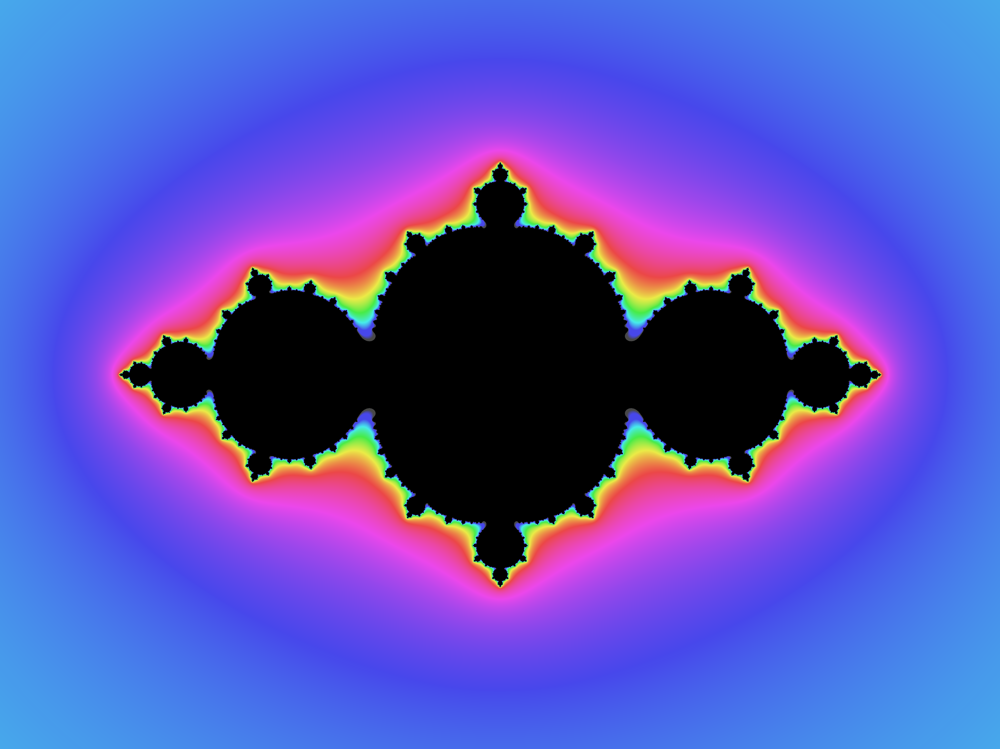
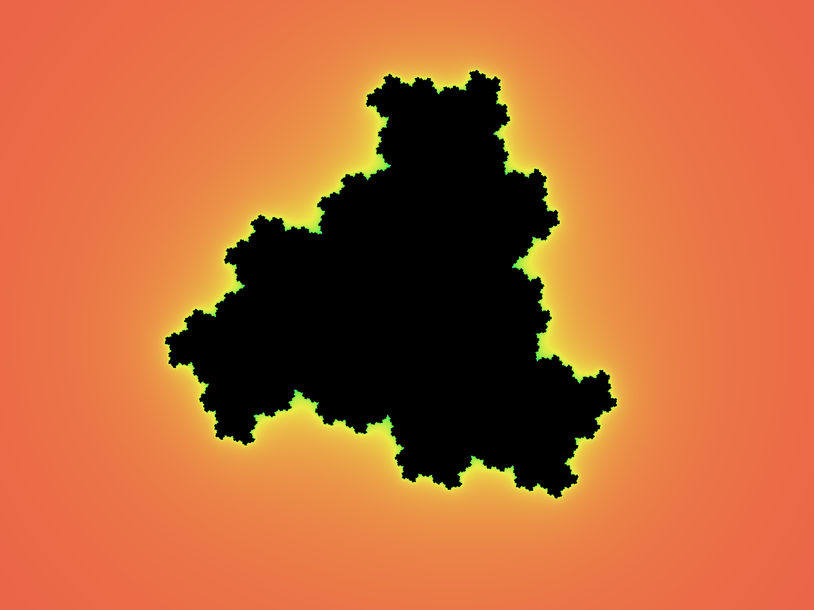

# Brot 🖌

A tool to produce aesthetically pleasing images of mandelbrot and julia sets from the command line.

## Setup

Using this tool requires a working Go environment. 
See the [installation instructions for Go](https://golang.org/doc/install) or [read the articles on DigitalOcean](https://www.digitalocean.com/community/tutorial_series/how-to-install-and-set-up-a-local-programming-environment-for-go).
For further information read [this article](https://www.digitalocean.com/community/tutorials/how-to-build-and-install-go-programs) on building and installing go programs.

Move to your projects folder and clone the repo:
```shell script
$ git clone https://github.com/bartolomej/brot && cd brot
```

Download all dependencies:
```shell script
$ go get
```

Run go program with:
```shell script
$ go run main.go
```

You can also install the program to use it as a cli tool from anywhere in the system by running:
```shell script
$ go install
```

Note that the above commands will only work if you correctly configured the go environment.

## Usage

Once you've installed this program with `go install` you can run commands with `brot`.
Without any arguments the program will render example image.

Create `config.json` file for custom parameters. Example syntax:
```json
{
  "scenes": [
    {
      "name": "mdb1",
      "type": "mandelbrot",
      "params": {
        "intervalX": [-2.1, 0.7],
        "intervalY": [-1.2, 1.2],
        "step": 0.01,
        "iter": 50,
        "hue": {
          "start": 0,
          "factor": 10
        }
      }
    },
    {
      "name": "jul1",
      "type": "julia",
      "params": {
        "intervalX": [-2, 2],
        "intervalY": [-1.5, 1.5],
        "step": 0.01,
        "iter": 15,
        "exp": [2, 0],
        "c": [-0.8,0],
        "hue": {
          "start": 170,
          "factor": 30
        }
      }
    }
  ]
}
```

Render a custom scene from config by providing `name` as a first parameter to `brot` command:
```shell script
$ brot <scene-name>
```

Image outputs are stored in `/out` folder.

## Cool resources
- [Mandelbrot set analyzed](https://www.youtube.com/watch?v=7MotVcGvFMg&t=379s)
- [Smooth shading implementation](http://linas.org/art-gallery/escape/smooth.html)

## Example images




